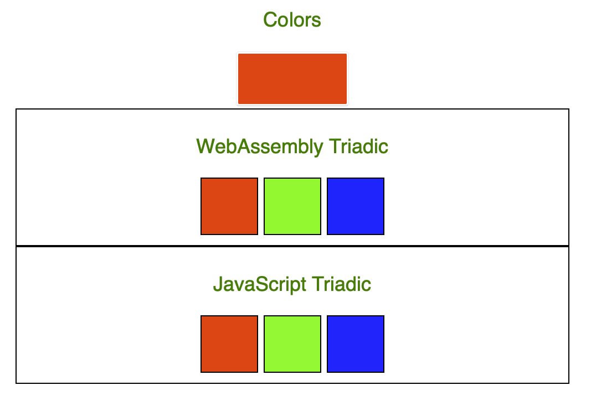

# Why the Web Wants WebAssembly

> Presentation for Code on the Beach 2019

## Files

* `webassembly.md` and the `images` directory make up the presentation, which is played through DeckSet <https://www.deckset.com>
* The `adder` directory contains the files for the Adder application
* The `colors` directory contains the files for the Colors application

## Adder

> WebAssembly module in `wat` format to add two numbers


### Requirements

* The WebAssembly Binary Toolkit <https://github.com/WebAssembly/wabt>
* Python 3 (or some other local web server)

### Build

```sh
$ cd adder
$ make
```

This will compile the WebAssembly module and start a local web server. Open your browser to <http://localhost:8000> and use the arrow keys to increment/decrement the addends.

### Files

* `add.wat` -- source for the WebAssembly module with a function to add two numbers
* `adder.js` -- JavaScript to load the WebAssembly module and set the event listener to call the `add` function
* `index.html` -- page for addend input and sum output
* `main.css` -- some amateur styling


## Colors

> Web App in WebAssembly and Rust that displays a triadic color palettes



### Requirements

* Rust <https://www.rust-lang.org>
* `wasm-pack` <https://rustwasm.github.io/wasm-pack/>
* `wasm32-unknown-unknown`
* npm <https://www.npmjs.com>

### Build

```sh
$ cd colors
$ wasm-pack build
$ cd www
$ npm install
$ npm run start
```

This will compile the WebAssembly module and start a local web server. Open your browser to <http://localhost:8080>, click the color at the top, select a new color, and watch the other colors update.

## License

Copyright &copy; 2019 Rob Warner

Licensed under the [MIT License](https://hoop33.mit-license.org/)
