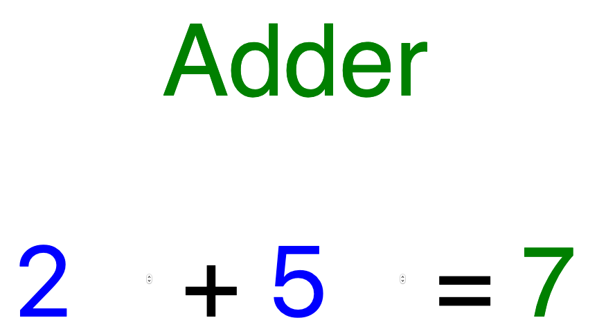

footer: https://github.com/hoop33/cotb_wasm
slidenumbers: true

# Why the Web Wants WebAssembly

## Rob Warner


* GitHub: @hoop33
* Twitter: @hoop33
* Email: hoop33@gmail.com
* Blog: https://grailbox.com

---

## Browser Support

* Chrome
* Edge
* Firefox
* Opera
* Safari

---

## What Is WebAssembly?

> "WebAssembly ... is a binary instruction format for a stack-based virtual machine."

https://webassembly.org

---

## WebAssembly Features

* Binary instruction format
* Stack-based
* Portable
* Hosted

---

## Sound Familiar?


---

## How Is WebAssembly Different?

* Still around
* Standards-based (W3C)
* Supports multiple languages
* Integrated with JavaScript
* Sandboxed
* Efficient

---

## Yeah, But Why?

> "So for sure, WebAssembly is faster (50x)"

(Ok, warning, clickbait)

https://www.ebayinc.com/stories/blogs/tech/webassembly-at-ebay-a-real-world-use-case/

---

## Why Not Just JavaScript

* Performance
* Competition
* Choice
* Reuse

---

## Tools

* WebAssembly Studio
  * https://webassembly.studio/
* The WebAssembly Binary Toolkit 
  * https://github.com/WebAssembly/wabt

---

## WASM Data Types

* `i32`
* `i64`
* `f32`
* `f64`

---

## First Project: Adder

* `wasm` function to add two integers
* Page to input numbers and display sum
* JavaScript to load module and call function
* CSS to add mediocre styling



---

## Add Function

```lisp
(module
  (func $add (param $lhs i32) (param $rhs i32) (result i32)
    get_local $lhs
    get_local $rhs
    i32.add)
  (export "add" (func $add))
)
```

---

## HTML

```html
<input type="number" id="lhs" min="0" value="0">
+
<input type="number" id="rhs" min="0" value="0">
=
<span id="sum">0</span>
```

---

## JavaScript

```javascript
fetch('./add.wasm')
  .then(response => response.arrayBuffer())
  .then(bytes => WebAssembly.instantiate(bytes))
  .then(results => {
    const instance = results.instance;
    // Set event listener here (next slide)
  })
  .catch(console.error);
```

---

## JavaScript (cont)

```javascript
const lhs = document.getElementById('lhs');
const rhs = document.getElementById('rhs');

const adder = function() {
  document.getElementById('sum').textContent = instance.exports.add(
    parseInt(lhs.value),
    parseInt(rhs.value),
  );
};

lhs.addEventListener('change', adder);
rhs.addEventListener('change', adder);
```

---

## Rust

* Graydon Hoare, 2006
* Mozilla, 2009
* 1.0, 2015

---

## Why Rust?

* Small binaries
* Fast
* Great tooling
* Memory safe
* "Most loved"

---

## Rust for JavaScript Developers

`npm` => `cargo`
`package.json` => `Cargo.toml`

* Modules
* Ownership
* Lifetimes
* snake_case

---

## Rust WebAssembly Tools

* Rust
* `wasm32-unknown-unknown` target
* `wasm-pack`
* `wasm_bindgen`

---

## Further Reading

* https://webassembly.org
* https://github.com/rustwasm/book
* _Programming WebAssembly with Rust_ by Kevin Hoffman
* https://github.com/mbasso/awesome-wasm
* https://github.com/appcypher/awesome-wasm-langs
* https://github.com/WebAssembly/binaryen (`wasm2js`)
* https://doc.rust-lang.org/book/

---

## Rob Warner

* GitHub: @hoop33
* Twitter: @hoop33
* Email: hoop33@gmail.com
* Blog: https://grailbox.com
* Repo: https://github.com/hoop33/cotb_wasm
