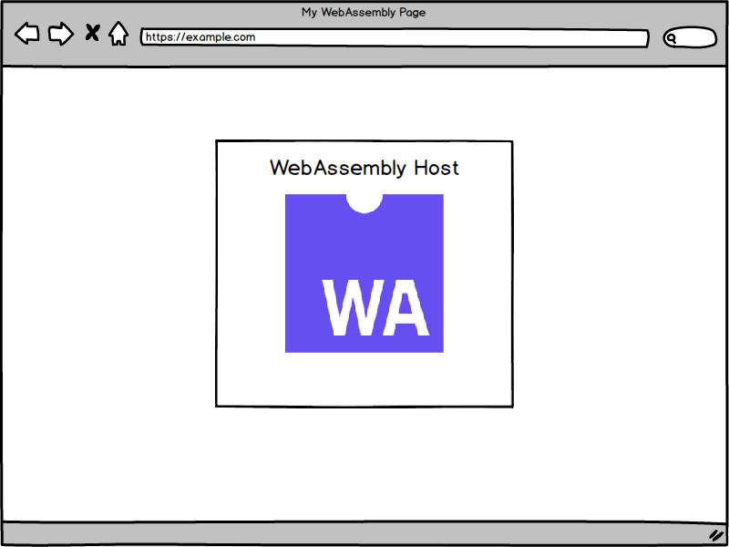
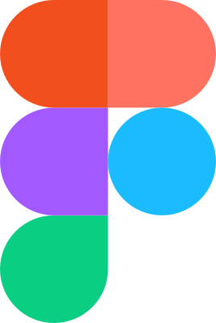
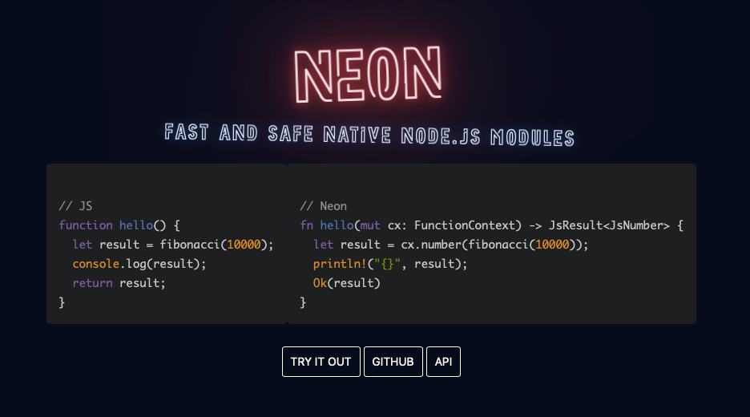
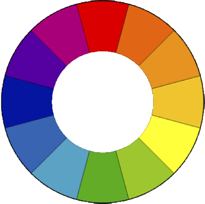

theme: Grailbox
footer: https://github.com/hoop33/cotb_wasm
slidenumbers: true

# Why the Web Wants WebAssembly

## Rob Warner


* GitHub: @hoop33
* Twitter: @hoop33
* Email: hoop33@gmail.com
* Blog: https://grailbox.com

---

## Overview

* What is WebAssembly?
* WebAssembly Use Cases
* Adder: Writing in `wat`
* Using Rust and `wasm-pack`

---

## What Is WebAssembly?

> "WebAssembly ... is a binary instruction format for a stack-based virtual machine."



---

## WebAssembly Features

* Binary instruction format
* Stack-based
* Hosted
* Portable

---

## Sound Familiar?


---

## How Is WebAssembly Different?

* Still around
* Standards-based (W3C)
* Supports multiple languages
* Integrates with JavaScript
* Sandboxed
* Efficient

---

## Browser Support


---

## Yeah, But Why?

> "So for sure, WebAssembly is faster (50x)"
> "How We Used WebAssembly To Speed Up Our Web App By 20X (Case Study)"
> "WebAssembly cut Figma's load time by 3x"




---

## Why Wouldn't I Just Use JavaScript?

* Performance
* Competition
* Choice
* Reuse

---

## Use Cases

* Full applications
* Frame in WebAssembly, UI in HTML/JavaScript
* Functions / Code called by JavaScript

---


---


---

## WASM Data Types

* `i32`
* `i64`
* `f32`
* `f64`

---

## First Project: Adder

* `wasm` function to add two integers
* Page to input numbers and display sum
* JavaScript to load module and call function
* CSS to add mediocre styling


---

## Add Function

```lisp
(module
  (func $add (param $lhs i32) (param $rhs i32) (result i32)
    get_local $lhs
    get_local $rhs
    i32.add)
  (export "add" (func $add))
)
```

---

## HTML

```html
<div class="content">
  <p>Adder</p>
  <input type="number" id="lhs" min="0" value="0">
  +
  <input type="number" id="rhs" min="0" value="0">
  =
  <span id="sum">0</span>
</div>
<script src="./adder.js"></script>
```

---

## JavaScript

```javascript
fetch('./add.wasm')
  .then(response => response.arrayBuffer())
  .then(bytes => WebAssembly.instantiate(bytes))
  .then(results => {
    setEventListener(results.instance);
  })
  .catch(console.error);
```

---

## JavaScript (cont)

```javascript
function setEventListener(wasm) {
  const lhs = document.getElementById('lhs');
  const rhs = document.getElementById('rhs');

  const adder = () => {
    document.getElementById('sum').textContent = wasm.exports.add(
      parseInt(lhs.value),
      parseInt(rhs.value),
    );
  };

  lhs.addEventListener('change', adder);
  rhs.addEventListener('change', adder);
}
```

---

## Why Rust for WebAssembly?

* Mozilla-backed
* Small binaries / faster download, parsing, etc.
* Fast
* Great tooling
* Memory safe
* "Most loved"

---

## Rust for JavaScript Developers

`npm` → `cargo`
`package.json` → `Cargo.toml`
`node_modules` → crates

---




---

## Colors


https://github.com/hoop33/hc

---

## Calculating Colors



* Hue (0 - 359º)
* Saturation (0 - 100%)
* Lightness (0 - 100%)

---

## How to Spin


---

## Setup

* Install Rust
* Install `wasm32-unknown-unknown` target
* Install `wasm-pack`
* Install `cargo-generate`
* Install `npm`

---

## Create Project

```sh
$ cargo generate --git https://github.com/rustwasm/wasm-pack-template
🤷  Project Name: colors
🔧   Creating project called `colors`...
✨   Done! New project created /Users/rwarner/Development/colors
```

---

## Cargo.toml

```toml
[package]
name = "colors"
version = "0.1.0"
authors = ["Rob Warner <rwarner@grailbox.com>"]
edition = "2018"

[lib]
crate-type = ["cdylib", "rlib"]

[features]
default = ["console_error_panic_hook"]

[dependencies]
wasm-bindgen = "0.2"
console_error_panic_hook = { version = "0.1.1", optional = true }
wee_alloc = { version = "0.4.2", optional = true }

[dev-dependencies]
wasm-bindgen-test = "0.2"

[profile.release]
opt-level = "s"
```

---

## Rust Source

```
src
├── lib.rs
└── utils.rs
tests
└── web.rs
```

---

## Import / Export

```rust
#[wasm_bindgen]
extern {
    fn alert(s: &str);
}

#[wasm_bindgen]
pub fn greet() {
    alert("Hello, colors!");
}
```

---

## Spin

```rust
#[wasm_bindgen]
pub fn spin(color: &str, degrees: i32) -> String {
    let spin_degrees = normalize_degrees(degrees);
    let (r, g, b) = hex_to_rgb(color);
    let (h, s, l) = rgb_to_hsl(r, g, b);
    let hspin = normalize_spin(h, spin_degrees);
    let (sr, sg, sb) = hsl_to_rgb(hspin, s, l);
    rgb_to_hex(sr, sg, sb)
}
```

---

## Normalize Degrees

```rust
fn normalize_degrees(degrees: i32) -> i32 {
    match degrees {
        d if d < 0 => (degrees % CIRCLE_DEGREES) + CIRCLE_DEGREES,
        _ => degrees % CIRCLE_DEGREES,
    }
}
```

---

## Hex to RGB

```rust
fn hex_to_rgb(color: &str) -> (i32, i32, i32) {
    lazy_static! {
        static ref RE: Regex = Regex::new("^#[A-Fa-f0-9]{6}$").unwrap();
    }
    match RE.is_match(color) {
        true => {
            let rgb = i32::from_str_radix(&color[1..], 16).unwrap();
            (((rgb & 0xff0000) >> 16), ((rgb & 0x00ff00) >> 8), (rgb & 0x00ff))
        },
        false => (0, 0, 0),
    }
}
```

---

## RGB to HSL

```rust
fn rgb_to_hsl(red: i32, green: i32, blue: i32) -> (i32, i32, i32) {
    let r: f64 = red as f64 / RGB_DIVISOR;
    let g: f64 = green as f64 / RGB_DIVISOR;
    let b: f64 = blue as f64 / RGB_DIVISOR;

    let min: f64 = r.min(g.min(b));
    let max: f64 = r.max(g.max(b));
    let range: f64 = max - min;

    let l: i32 = ((max + min) / 0.02) as i32;
    if range == 0.0 {
        return (0, 0, l);
    }
    ...
```

---

## RGB to HSL (cont)

```rust
    let mut h: i32;
    if (r - max).abs() < std::f64::EPSILON {
        h = (60.0 * (((g - b) / range) % 6.0)) as i32;
    } else if (g - max).abs() < std::f64::EPSILON {
        h = (60.0 * (((b - r) / range) + 2.0)) as i32;
    } else {
        h = (60.0 * (((r - g) / range) + 4.0)) as i32;
    }
    if h < 0 {
        h += CIRCLE_DEGREES;
    }

    let s: i32;
    if l < 50 {
        s = (100.0 * (range / (max + min))) as i32;
    } else {
        s = (100.0 * (range / (2.0 - max - min))) as i32;
    }

    (h, s, l)
}
```

---

## Normalize Spin

```rust
fn normalize_spin(h: i32, degrees: i32) -> i32 {
    (h + degrees) % CIRCLE_DEGREES
}
```

---

## HSL to RGB

```rust
fn hsl_to_rgb(h: i32, s: i32, l: i32) -> (i32, i32, i32) {
    let lightness: f64 = l as f64 / 100.0;
    let saturation: f64 = s as f64 / 100.0;
    let c: f64 = (1.0 - ((2.0 * lightness) - 1.0).abs()) * saturation;
    let x: f64 = c * (1.0 - (((h as f64 / 60.0) % 2.0) - 1.0).abs());
    let m: f64 = lightness - (c / 2.0);

    let (r, g, b) = match h {
        h if h < 60 => (c, x, 0.0),
        h if h < 120 => (x, c, 0.0),
        h if h < 180 => (0.0, c, x),
        h if h < 240 => (0.0, x, c),
        h if h < 300 => (x, 0.0, c),
        _ => (c, 0.0, x),
    };

    (((r + m) * 255.0) as i32, ((g + m) * 255.0) as i32, ((b + m) * 255.0) as i32)
}
```

---

## RGB to Hex

```rust
fn rgb_to_hex(r: i32, g: i32, b: i32) -> String {
    format!("#{:02X}{:02X}{:02X}", r, g, b)
}
```

---

## Build Module

```sh
$ wasm-pack build
```

---

## Test Module

```rust
#[wasm_bindgen_test]
fn spin_should_return_ice_when_coffee_and_45() {
    assert_eq!("#BCE0FF", colors::spin("#C0FFEE", 45));
}
```

```sh
$ wasm-pack test --firefox --headless
```

---

## Module Files

```
pkg
├── README.md
├── colors.d.ts
├── colors.js
├── colors_bg.d.ts
├── colors_bg.wasm
└── package.json
```

---

## Colors.js

```javascript
export function spin(color, degrees) {
    const ptr0 = passStringToWasm(color);
    const len0 = WASM_VECTOR_LEN;
    const retptr = globalArgumentPtr();
    try {
        wasm.spin(retptr, ptr0, len0, degrees);
        const mem = getUint32Memory();
        const rustptr = mem[retptr / 4];
        const rustlen = mem[retptr / 4 + 1];

        const realRet = getStringFromWasm(rustptr, rustlen).slice();
        wasm.__wbindgen_free(rustptr, rustlen * 1);
        return realRet;
    } finally {
        wasm.__wbindgen_free(ptr0, len0 * 1);
    }
}
```

---

## Build Web App

```sh
$ npm init wasm-app www
npx: installed 1 in 2.104s
🦀 Rust + 🕸 Wasm = ❤
```

---

## Add Module

```json
"dependencies": {
  "colors": "file:../pkg"
}
```

---

## HTML

```html
<body>
  <div class="content">
    <p>Colors</p>
    <input type="color" id="base">

    <div class="palette">
      <p>Triadic</p>
      <span class="well" id="triad1"></span>
      <span class="well" id="triad2"></span>
      <span class="well" id="triad3"></span>
    </div>

  </div>
  <script src="./bootstrap.js"></script>
</body>
```

---

## JavaScript

```javascript
import * as colors from 'colors';

const base = document.getElementById('base');
const triad1 = document.getElementById('triad1');
const triad2 = document.getElementById('triad2');
const triad3 = document.getElementById('triad3');

base.addEventListener('change', event => {
  const bc = event.srcElement.value;
  triad1.style.backgroundColor = bc;
  triad2.style.backgroundColor = colors.spin(bc, 120);
  triad3.style.backgroundColor = colors.spin(bc, 240);
});
```

---

## Further Reading

* https://webassembly.org
* https://rustwasm.github.io/wasm-pack/
* https://neon-bindings.com
* https://github.com/rustwasm/book
* https://www.ebayinc.com/stories/blogs/tech/webassembly-at-ebay-a-real-world-use-case/
* https://www.smashingmagazine.com/2019/04/webassembly-speed-web-app/
* https://www.figma.com/blog/webassembly-cut-figmas-load-time-by-3x/
* https://github.com/shamadee/web-dsp

---

## Further Reading (cont) 

* _Programming WebAssembly with Rust_ by Kevin Hoffman
* https://github.com/mbasso/awesome-wasm
* https://github.com/appcypher/awesome-wasm-langs
* https://github.com/WebAssembly/binaryen (`wasm2js`)
* https://doc.rust-lang.org/book/
* https://webassembly.studio/
* https://github.com/WebAssembly/wabt
* https://rsms.me/wasm-intro

---

## Rob Warner

* GitHub: @hoop33
* Twitter: @hoop33
* Email: hoop33@gmail.com
* Blog: https://grailbox.com
* Repo: https://github.com/hoop33/cotb_wasm
